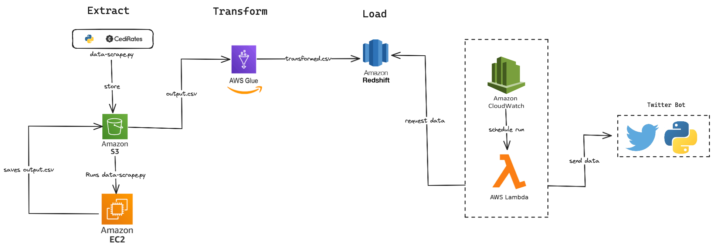

**[Fuel Prices Pipeline]{.underline}**

OBJECTIVE:\
The objective of this project is to build a data pipeline that gets data
regarding the prices of fuel on a daily basis, saves it to a data
warehouse and creates an automated tweet daily announcing the prices.

ARCHITECTURE DIAGRAM

{width="6.268054461942257in"
height="2.2041655730533685in"}

CURRENT LIMITATIONS:\
1.The pipeline implementation is incomplete\
2.The pipeline has not yet been orchestrated to run at specific
intervals (daily) 3.Twitter bot implementation is not complete\
4.Minimal transformation ideas of the raw scraped data
