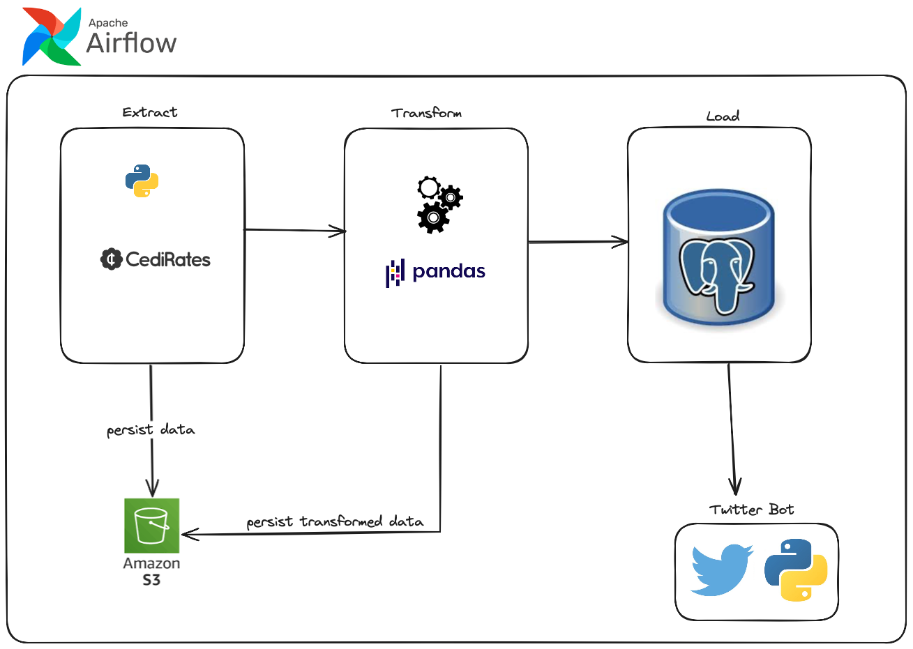

# [Fuel Prices Pipeline]

## OBJECTIVE:\
The objective of this project is to build a data pipeline that gets data
regarding the prices of fuel on a daily basis, saves it to a data
warehouse and creates an automated tweet daily announcing the prices.

## ARCHITECTURE DIAGRAM

## Current Overview:\
Currently the data is fetched from an API and saved locally, the data is then transformed to extract information that the avg fuel price and the 
lowest and highest prices and the statiosn with those prices. This retrieved data is stored in psotgres and would be used to fill up a tweet template 
that a twitter bot would tweet on a daily basis using airflow as an orchestrator. 
